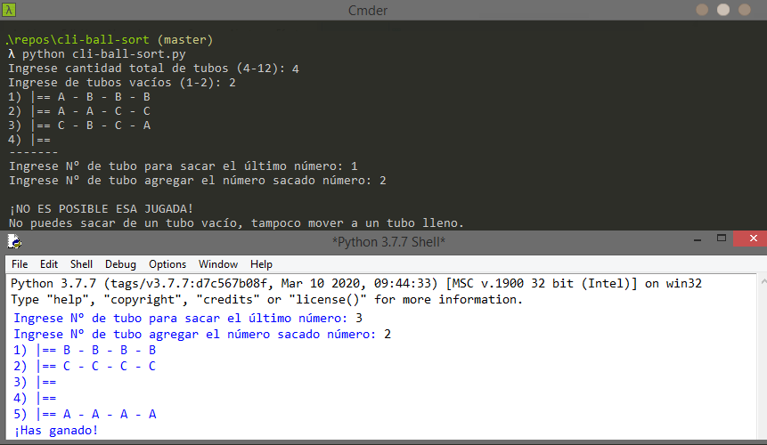

# CLI Ball Sort Puzzle Game
[](https://github.com/Marfullsen/cli-ball-sort)
[](https://github.com/Marfullsen/cli-ball-sort)
[](https://github.com/Marfullsen/cli-ball-sort)
[](https://github.com/Marfullsen/cli-ball-sort)

---

## Desc
Game like "Ball Sort Puzzle" written in Python for the command-line.
---

## Usage
1. Install `git` & `python3`.
2. Clone and enter the directory.
``` 
git clone https://github.com/Marfullsen/cli-ball-sort.git
cd cli-ball-sort
python cli-ball-sort.py
```
3. Have fun!

---

## How to play

1) Place elements with same char into one row.
2) Take any element at the end of a row and move it into an empty row or next to an element with same char.
3) You win if all rows are filled with only one type of element, or are empty.
Viel Glück! :four_leaf_clover:

### beginner game: 
#### 4 rows & 1 Empty. (very easy).

### Standard game:
#### 5 rows & 2 empty. (easy).

### Moderate game:
#### 6 rows & 2 empty (Medium).

### Difficult game:
#### 8 rows & 2 empty (Hard).

## Madness game:
### 11 rows & 2 empty (Extreme).
---

## Credit
This game is inspired by [Ball Sort Puzzle](https://play.google.com/store/apps/details?id=com.GMA.Ball.Sort.Puzzle).
Other games like this are:
[Sort Puzzle: Fun Ball](https://play.google.com/store/apps/details/Sort_Puzzle_Fun_Ball?id=com.playcus.ball.sort.puzzle)
[Ball Sort Max](https://play.google.com/store/apps/details?id=com.bsm.ballsortmax)
[Sort It 3D](https://play.google.com/store/apps/details?id=com.game.sortit3d)
[Water Sort Puzzle](https://play.google.com/store/apps/details?id=com.gma.water.sort.puzzle)
[Liquid Sort Puzzle - Water Sort Puzzle](https://play.google.com/store/apps/details?id=com.picolaf.liquidsortpuzzle)
