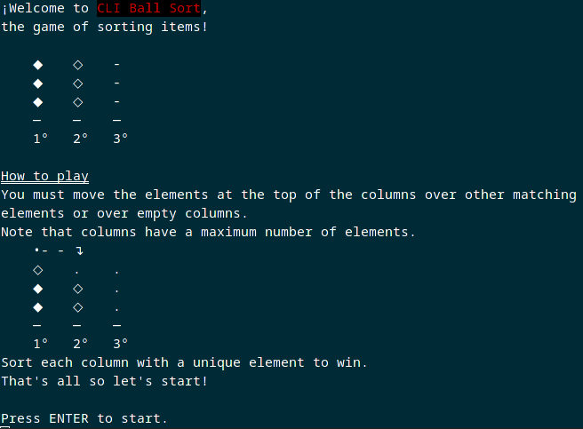
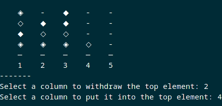

# CLI Ball Sort Puzzle Game
[](https://github.com/Marfullsen/cli-ball-sort)
[](https://github.com/Marfullsen/cli-ball-sort)
[](https://github.com/Marfullsen/cli-ball-sort)
[](https://github.com/Marfullsen/cli-ball-sort)

---

## Desc

Game like "Ball Sort Puzzle" written in Python for the command-line.

---

## Usage
1. Install `git` & `python3`.
2. Clone and enter the directory.
``` 
git clone https://github.com/Marfullsen/cli-ball-sort.git
cd cli-ball-sort
python cli-ball-sort.py
```
3. Have fun!

---

## How to play

1) Place elements with same element into a column.
2) Take any element at the top of a column and move it into an empty column or over an element with same element.
3) You win if all columns are sorted with only one type of element or empty.
Good luck!

[](https://github.com/Marfullsen/cli-ball-sort)

### beginner game: 
- 4 columns & 1 Empty. (very easy).

### Standard game:
- 5 columns & 2 empty. (easy).

### Moderate game:
- 6 columns & 2 empty (Medium).

### Difficult game:
- 8 columns & 2 empty (Hard).

### Madness game:
- 11 columns & 2 empty (Extreme).

---

## Credit
This game is inspired by [Ball Sort Puzzle](https://play.google.com/store/apps/details?id=com.GMA.Ball.Sort.Puzzle).

### Other games like this are:
- [Sort Puzzle: Fun Ball](https://play.google.com/store/apps/details/Sort_Puzzle_Fun_Ball?id=com.playcus.ball.sort.puzzle)
- [Ball Sort Max](https://play.google.com/store/apps/details?id=com.bsm.ballsortmax)
- [Sort It 3D](https://play.google.com/store/apps/details?id=com.game.sortit3d)
- [Water Sort Puzzle](https://play.google.com/store/apps/details?id=com.gma.water.sort.puzzle)
[Liquid Sort Puzzle - Water Sort Puzzle](https://play.google.com/store/apps/details?id=com.picolaf.liquidsortpuzzle)
